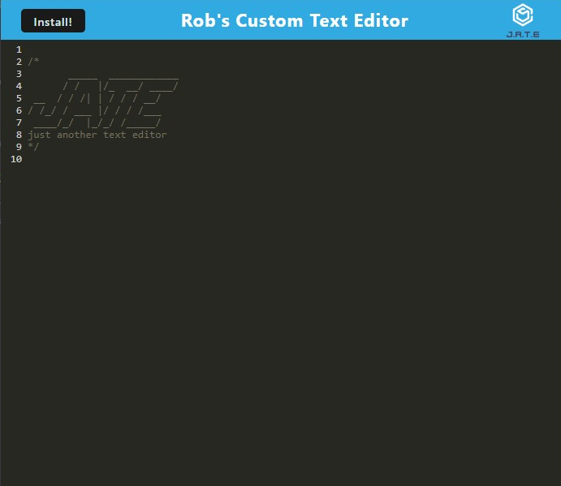

# Robs-Custom-Text-Editor

[](https://opensource.org/licenses/MIT)

## Description:

This repository was created as a part of the University of Richmond's Bootcamp, Module 19 Challenge. The challenge was to build a text editor that runs in the browser. The app is a single-page application that meets the PWA criteria. The application also functions offline. The application was built using React, Node.js, Express.js, IndexedDB, and Webpack. The application is deployed to Heroku at the following URL: https://robs-custom-text-editor-37c320f23a5f.herokuapp.com/

The following User Story and Acceptance Criteria were provided for this challenge:

> ## User Story
>
> ```md
> AS A developer
> I WANT to create notes or code snippets with or without an internet connection
> SO THAT I can reliably retrieve them for later use
> ```
>
> ## Acceptance Criteria
>
> ```md
> GIVEN a text editor web application
> WHEN I open my application in my editor
> THEN I should see a client server folder structure
> WHEN I run `npm run start` from the root directory
> THEN I find that my application should start up the backend and serve the client
> WHEN I run the text editor application from my terminal
> THEN I find that my JavaScript files have been bundled using webpack
> WHEN I run my webpack plugins
> THEN I find that I have a generated HTML file, service worker, and a manifest file
> WHEN I use next-gen JavaScript in my application
> THEN I find that the text editor still functions in the browser without errors
> WHEN I open the text editor
> THEN I find that IndexedDB has immediately created a database storage
> WHEN I enter content and subsequently click off of the DOM window
> THEN I find that the content in the text editor has been saved with IndexedDB
> WHEN I reopen the text editor after closing it
> THEN I find that the content in the text editor has been retrieved from our IndexedDB
> WHEN I click on the Install button
> THEN I download my web application as an icon on my desktop
> WHEN I load my web application
> THEN I should have a registered service worker using workbox
> WHEN I register a service worker
> THEN I should have my static assets pre cached upon loading along with subsequent pages and static assets
> WHEN I deploy to Heroku
> THEN I should have proper build scripts for a webpack application
> ```

## Table of Contents

-    [Installation](#installation)
-    [Usage](#usage)
-    [License](#license)
-    [Contributing](#contributing)
-    [Tests](#tests)
-    [Questions](#questions)

## Installation

This application has been deployed to a live site at the following URL: https://robs-custom-text-editor-37c320f23a5f.herokuapp.com/

If you would like to see this application in its development environment, please follow the instructions below.

This application requires Node.js to run. Please visit https://nodejs.org/en/ to download Node.js if it is not already installed on your computer.

If you are unfamiliar with cloning a repository, please click on the following link to learn: [Github docs | Cloning a repository](https://docs.github.com/en/repositories/creating-and-managing-repositories/cloning-a-repository)

To install this application locally, clone the repository, navigate to its directory in the terminal, and run `npm install` in the command line to install the required dependencies.

The following scripts are available to run in the command line from the root directory of the project:

```json
     "scripts": {
          "start:dev": "concurrently \"cd client && npm run build\" \"cd server && npm run server\" ",
          "start": "npm run build && cd server && node server.js",
          "server": "cd server node server.js --ignore client",
          "build": "cd client && npm run build",
          "install": "cd server && npm i --omit=dev && cd ../client && npm i --omit=dev",
          "client": "cd client && npm start"
     },
```

Use the command `npm run start` to start the server and run the application. Navigate to http://localhost:3001/ in your browser to view the application.

## Usage

After navigating to the application in your browser, you will see the following screen:



To use the application, click on the text area and begin typing. The text will be saved when the DOM window is unfocused. If you close the browser and reopen it, the text will be retrieved from the database and displayed in the text area.

To install the application, click on the install button in the address bar of your browser or the install button in the header of the application. The application will be installed on your computer and can be opened from your desktop. The application will function offline.

## License

This application is licensed under the MIT license. See the following link for more information: https://opensource.org/licenses/MIT

## Contributing

Feel free to contribute to this project! Please fork the repository and create a pull request with your changes.

## Tests

No tests are included in this application.

## Questions

If you have any questions, please contact me at drgstriker@aol.com. You can also visit my GitHub profile at https://github.com/RobSprouse.
